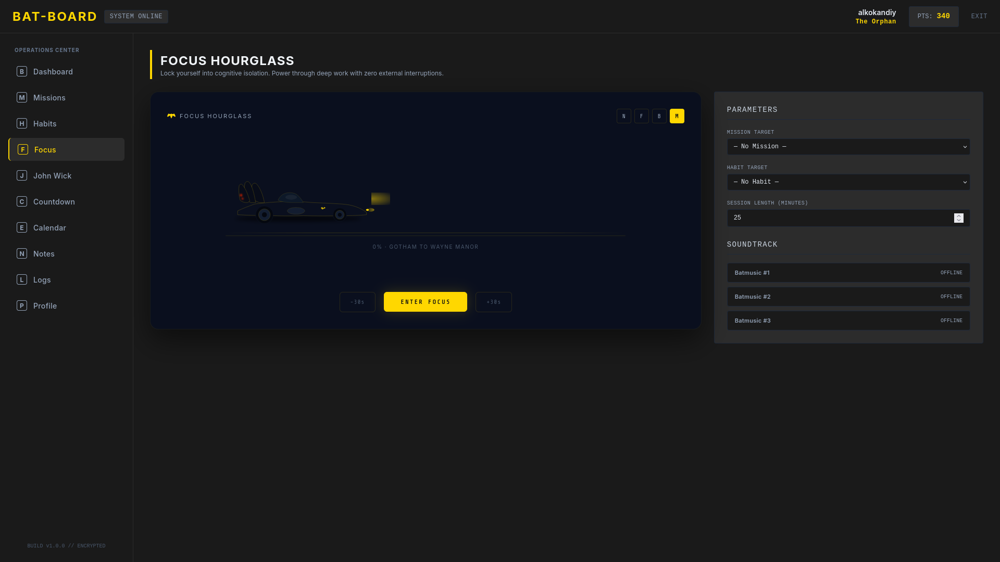
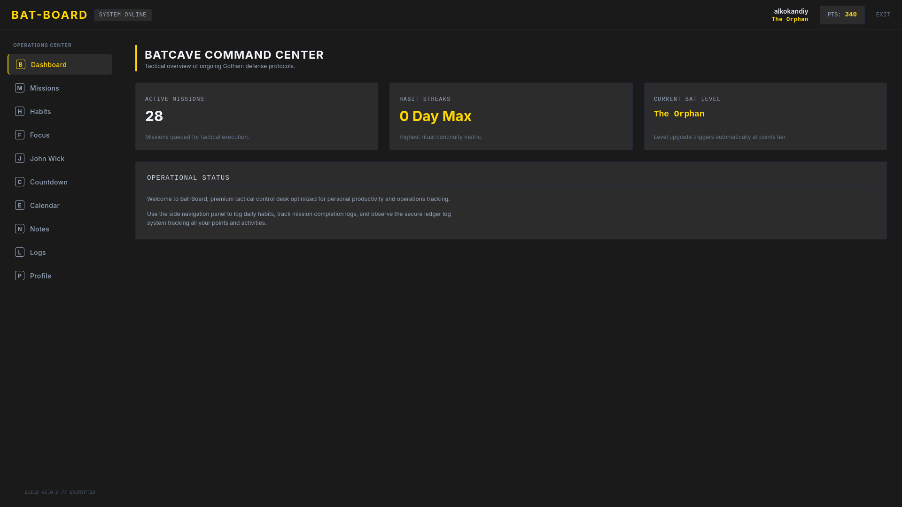
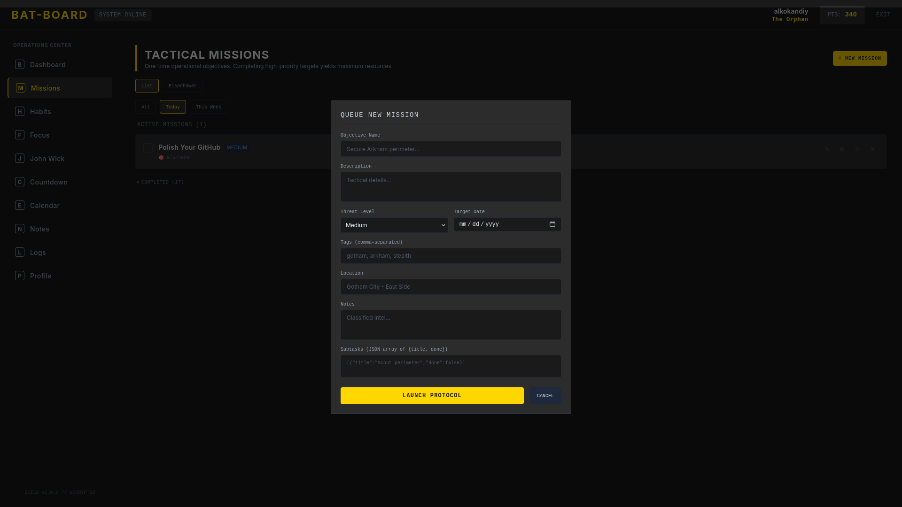
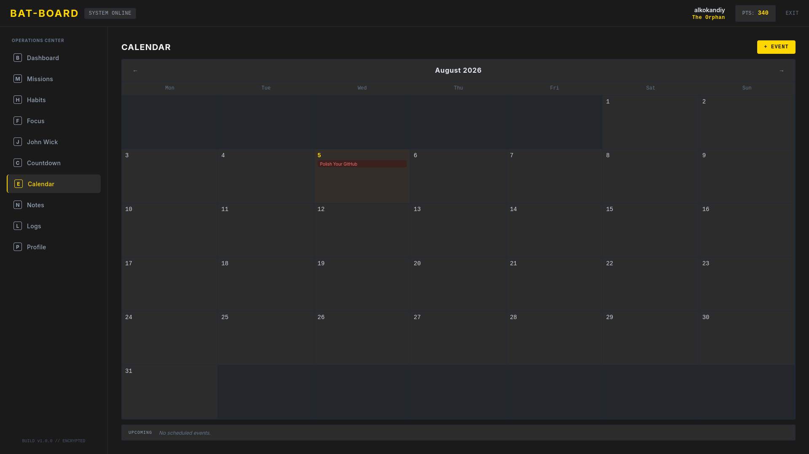

<div align="center">

# 🦇 Bat-Board

**A Batman-themed personal productivity dashboard — missions, habit streaks, a multi-mode focus timer, and activity logging, wrapped in a dark command-center UI.**


</div>

---

## Screenshots

<div align="center">

| Dashboard | Missions | Habits | Focus Timer |
|:---------:|:--------:|:------:|:-----------:|
|  |  |  |  |

</div>

---

## Overview

10 dedicated views, no router — state-driven via `currentView` in `App.jsx`. Every module is complete and CRUD-backed against a real **FastAPI + PostgreSQL** backend behind **JWT auth**.

---

## Features

| Module | Description |
|--------|-------------|
| **Dashboard** | Summary cards (pending missions, max habit streak, bat level) + welcome block |
| **Missions** | Full CRUD, search, sort, filter by status/tags, pin/dismiss |
| **Habits** | Streak tracking, daily check-in, completion history |
| **Focus Hourglass** | Fullscreen Pomodoro timer with 4 visual modes (Normal, Flip Clock, Bat-Signal spotlight reveal, Batmobile route tracker), mission/habit targeting, integrated soundtrack |
| **John Wick Timer** | Stylized countdown with blood-drip animation and gun-sight UI |
| **Countdown** | Custom countdowns to user-set dates |
| **Calendar** | Monthly view with events linked to missions |
| **Notes** | Two-pane, Apple Notes-style editor with CRUD, search, sort, pin, tags, auto-save |
| **Logs** | Activity/event log (points earned, completions, etc.) |
| **Profile** | Account settings, bat-level display |

---

## Tech Stack

### Frontend

| Technology | Version | Purpose |
|------------|---------|---------|
| React | 18.2 (JSX) | UI library |
| Vite | 4.4.5 | Build tool & dev server |
| Tailwind CSS | 3.4.3 | Utility-first styling |
| State Management | React built-ins (`useState`, `useRef`, `useCallback`) | No external state library |
| Fonts | Inter (UI), Share Tech Mono (monospace), Bebas Neue (display), Rajdhani (body) | Typography |

**Custom Tailwind tokens:** `matte-obsidian`, `electric-bat-yellow`, `dark-slate`, `bat-surface`, `bat-card`

### Backend

| Technology | Version | Purpose |
|------------|---------|---------|
| Python | 3.12+ | Runtime |
| FastAPI | 0.111.0 | Web framework |
| SQLAlchemy | 2.0.29 | ORM |
| Alembic | 1.12.1 | Database migrations |
| Uvicorn | 0.29.0 | ASGI server (dev) |
| Gunicorn | 22.0.0 | ASGI server (prod) |
| Pydantic | v2.7.1 | Data validation |
| structlog | 24.1.0 | Structured logging |
| slowapi | 0.1.9 | Rate limiting (5/min register, 10/min login) |

### Database

| Environment | Engine |
|-------------|--------|
| Development | SQLite (`batboard.db`) |
| Production | PostgreSQL 16 (`postgres:16-alpine` via Docker Compose) |

**7 tables:** `bat_account`, `bat_missions`, `bat_habits`, `habit_completion_logs`, `bat_log`, `bat_focus`, `bat_calendar_events`

### Auth

- **JWT** (HS256, via `python-jose`)
- Passwords hashed with **bcrypt** (`passlib`)
- Access token: **24h** · Refresh token: **30 days**, auto-refreshed hourly
- `OAuth2PasswordBearer` scheme, tokens stored in `localStorage`

### Sync

No WebSockets/SSE — timer accuracy is handled client-side via `setInterval` + `Date.now()`

### Deployment

Docker + Docker Compose, deployable to **Railway**

---

## Getting Started

### Prerequisites

- **Docker & Docker Compose** (or Node 18+ / Python 3.12+ for local dev without containers)

### Run with Docker

```bash
# Clone the repository
git clone https://github.com/your-username/bat-board.git
cd bat-board

# Start all services
docker compose up

# Access the app
open http://localhost:5173
```

### Local Development (without Docker)

**Backend:**

```bash
cd backend
python -m venv .venv && source .venv/bin/activate
pip install -r requirements.txt
cp .env.example .env  # edit SECRET_KEY
uvicorn main:app --reload --port 8000
```

**Frontend:**

```bash
cd frontend
npm install
cp .env.example .env
npm run dev
```

---

## Environment Variables

| Variable | Required | Default | Description |
|----------|----------|---------|-------------|
| `DATABASE_URL` | No | `sqlite:///./batboard.db` | PostgreSQL URL (Railway sets this) |
| `SECRET_KEY` | Recommended | default string | JWT signing key — set a strong one |
| `ENVIRONMENT` | No | `production` | `development` enables API docs |
| `CORS_ORIGINS` | No | `["http://localhost:5173"]` | JSON array or comma-separated |
| `LOG_FORMAT` | No | `console` | `json` for structured logging |

---

## API Endpoints

### Authentication

| Method | Path | Auth | Description |
|--------|------|------|-------------|
| `POST` | `/api/auth/register` | No | Create account |
| `POST` | `/api/auth/login` | No | Get tokens |
| `POST` | `/api/auth/refresh` | No | Refresh tokens |
| `GET` | `/api/auth/me` | Yes | Current user |

### Account

| Method | Path | Auth | Description |
|--------|------|------|-------------|
| `GET` | `/api/account` | Yes | Get account |
| `PUT` | `/api/account` | Yes | Update account |
| `PUT` | `/api/account/password` | Yes | Change password |
| `POST` | `/api/account/reset-points` | Yes | Reset points to zero |

### Missions

| Method | Path | Auth | Description |
|--------|------|------|-------------|
| `GET` | `/api/missions` | Yes | List missions |
| `POST` | `/api/missions` | Yes | Create mission |
| `PUT` | `/api/missions/{id}` | Yes | Update mission |
| `DELETE` | `/api/missions/{id}` | Yes | Delete mission |

### Habits

| Method | Path | Auth | Description |
|--------|------|------|-------------|
| `GET` | `/api/habits` | Yes | List habits |
| `POST` | `/api/habits` | Yes | Create habit |
| `PUT` | `/api/habits/{id}` | Yes | Update habit |
| `DELETE` | `/api/habits/{id}` | Yes | Delete habit |
| `POST` | `/api/habits/{id}/check-in` | Yes | Complete habit |

### Calendar

| Method | Path | Auth | Description |
|--------|------|------|-------------|
| `GET` | `/api/calendar/events` | Yes | List calendar events |
| `POST` | `/api/calendar/events` | Yes | Create calendar event |
| `PUT` | `/api/calendar/events/{id}` | Yes | Update calendar event |
| `DELETE` | `/api/calendar/events/{id}` | Yes | Delete calendar event |

### Focus Sessions

| Method | Path | Auth | Description |
|--------|------|------|-------------|
| `POST` | `/api/focus/sessions` | Yes | Start focus session |
| `PUT` | `/api/focus/sessions/{id}` | Yes | End focus session |
| `GET` | `/api/focus/sessions` | Yes | List focus sessions |

### Logs

| Method | Path | Auth | Description |
|--------|------|------|-------------|
| `GET` | `/api/logs` | Yes | List activity logs |
| `POST` | `/api/logs` | Yes | Create log entry |

### System

| Method | Path | Auth | Description |
|--------|------|------|-------------|
| `GET` | `/api/health` | No | Health check |

---

## Project Structure

```
bat-board/
├── backend/
│   ├── main.py              # FastAPI app — all endpoints
│   ├── models.py            # SQLAlchemy ORM models
│   ├── config.py            # Settings & env vars
│   ├── database.py          # DB engine & session
│   ├── auth.py              # JWT & password utilities
│   ├── alembic/             # Database migrations
│   ├── tests/               # Backend test suite
│   ├── Dockerfile           # Backend container
│   └── requirements.txt     # Python dependencies
├── frontend/
│   ├── src/
│   │   ├── App.jsx          # Root component — state-driven routing
│   │   ├── main.jsx         # Entry point
│   │   ├── index.css        # Global styles & Tailwind config
│   │   ├── components/      # 13 UI modules
│   │   │   ├── DashboardLayout.jsx
│   │   │   ├── MissionsPanel.jsx
│   │   │   ├── HabitsPanel.jsx
│   │   │   ├── FocusPanel.jsx
│   │   │   ├── BatFocusTimer.jsx
│   │   │   ├── FlipTimer.jsx
│   │   │   ├── JohnWickPanel.jsx
│   │   │   ├── CountdownPanel.jsx
│   │   │   ├── CalendarPanel.jsx
│   │   │   ├── NotesPanel.jsx
│   │   │   ├── LogsPanel.jsx
│   │   │   ├── ProfileSettings.jsx
│   │   │   └── AudioPlayer.jsx
│   │   └── utils/           # Helper functions
│   ├── public/              # Static assets
│   ├── index.html           # Vite entry
│   ├── tailwind.config.cjs  # Tailwind custom tokens
│   └── vite.config.js       # Vite config
├── docker-compose.yml       # Multi-service orchestration
├── Dockerfile               # Root Dockerfile (Railway)
└── railway.toml             # Railway deployment config
```

---

## Deploy to Railway

### One-click Deploy

1. Push repo to GitHub
2. Create a new Railway project from the repo
3. Add a PostgreSQL plugin
4. Set environment variables in Railway dashboard:
   - `SECRET_KEY` — a random 64-character string
   - `ENVIRONMENT` — `production`
   - `CORS_ORIGINS` — `["*"]` or your frontend domain
5. Railway uses the root `Dockerfile` and sets `DATABASE_URL` automatically via the PostgreSQL plugin

---

## License

MIT
